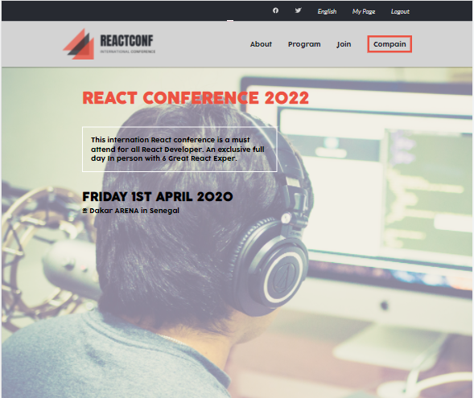
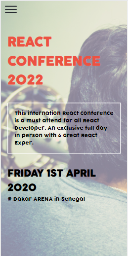

# React Conference 2022

> React Conference 2022 is an unreal event just for the porpuse of learning.

## Built With

- HTML5
- CSS3
- JavaScript

## Getting Started

This is a simple static website of two pages a home and an about page, made with HTML5, CSS3 and JavaScript.

## Live Demo

[Live Demo Link](https://ridwanediallo.github.io/Conference-page/)

## Authors

👤 **Ridwan Diallo**

- GitHub: [@githubridwan](https://github.com/ridwanediallo)
- Twitter: [@twitterridwan](https://twitter.com/RidwaneD)
- LinkedIn: [LinkedIn](https://www.linkedin.com/in/ridwan-diallo-9a1634193)

## 🤝 Contributing

Contributions, issues, and feature requests are welcome!

Feel free to check the [issues page](../../issues/).

## Show your support

Give a ⭐️ if you like this project!

## Acknowledgments

- The original design is made by Cindy Shin called [CC Global Summit 2015](https://www.behance.net/gallery/29845175/CC-Global-Summit-2015)

## 📝 License

This project is [MIT](./MIT.md) licensed.
